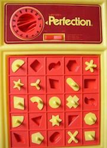

# Workshop

造轮子项目，主要用原生 JS 实现算法，数据结构，小组件甚至是小项目。
在平时忙项目的同时，不妨尝试下不依赖工具和库实现一些常见的功能，即便是简单的功能，自己动手实现一遍也有所收获。

## Widgets

### [Tabs](./src/widgets/Tabs/README.md)
随处可见的 Tabs

## 轮子

### [Redux](./src/wheels/redux/README.md)

### React

### [R2 Interpreter](./src/wheels/interpreter/README.md)
来自 [怎样写一个解释器](http://www.yinwang.org/blog-cn/2012/08/01/interpreter)，可以对闭包有一个更好的了解。

## Game

### Perfection game

### [1024 game](./src/challenge/1024-game/README.md)
